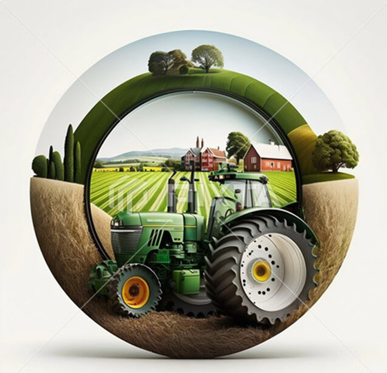

<div align="center">



# 🌾 FarmAI: The Intelligent Agronomist

**Precision Agriculture Powered by Multi-Tiered AI Consensus & Explainable Diagnostics**

[Features](#-features) • [How It Works](#-how-it-works) • [Tech Stack](#️-tech-stack) • [Installation](#️-installation) • [Deployment](#-deployment)

---

</div>

# 🌱 Overview

**FarmAI** is a production-grade, end-to-end intelligent platform designed to bridge the gap between advanced machine learning and practical field agriculture. By combining **Random Forest classifiers**, **Multi-Modal LLMs (Gemini, Groq)**, and **Computer Vision (Grad-CAM)**, FarmAI provides farmers with hyper-local, actionable insights for crop selection, disease management, and economic forecasting.

The platform doesn't just provide a result; it provides a **reason**. Through integrated **Explainable AI (XAI)**, it translates complex model parameters into "Farmer-Friendly" natural language, ensuring that even non-technical users can trust and act upon the AI's recommendations.

---

# 🚀 Features

### 🚜 Precision Crop Intelligence
*   **99.3% Accuracy**: Driven by a specialized **Random Forest Classifier** trained on 101,000+ soil samples across 101 crop varieties.
*   **Environmental Profiling**: Analyzes NPK (Nitrogen, Phosphorus, Potassium), pH levels, Temperature, Humidity, and Rainfall.
*   **Economic Forecasting**: Provides real-time estimates for **Expected Yield** and **Estimated Profit (₹)** per acre based on Indian market trends.

### 🔬 Explainable AI (XAI)
*   **Visual Evidence (Grad-CAM)**: Uses Gradient-weighted Class Activation Mapping to highlight exactly *where* the AI detected disease on a leaf photo.
*   **Feature Contribution**: Powered by **SHAP**, showing how each environmental factor influenced a recommendation.
*   **Natural Language Summaries**: Translates technical jargon into simple English/Hindi explanations (e.g., *"Suitable because of high water availability"*).

### 🩺 Expert Disease Diagnostics
*   **Multi-Tier Consensus**: A robust pipeline that aggregates intelligence from **Gemini 1.5 Flash**, **Groq Llama 3.2**, and a high-precision **Local Fallback** model.
*   **Pathology Reports**: Detailed treatment plans including chemical dosages, spray safety protocols, and regional cost estimations.
*   **Voice Assistant**: Integrated multilingual Text-to-Speech (TTS) to read out diagnostics for better accessibility.

### 🔐 Secure & Integrated Ecosystem
*   **History Synchronization**: MongoDB-backed persistence for every scan and prediction.
*   **Enterprise Auth**: JWT-based secure authentication with encrypted profiles.
*   **Optimized Deployment**: High-performance FastAPI backend with **multi-stage Docker builds** for sub-4GB cloud images.

---

# 🧠 How It Works

1.  **Input**: Farmer provides soil data via the dashboard or uploads high-res photos of crop leaves.
2.  **Multi-Tier Analysis**: 
    *   **Tabular Tier**: Random Forest processes soil metrics for crop suitability.
    *   **Vision Tier**: PyTorch-based Grad-CAM identifies infection zones, while Gemini/Groq provide clinical pathology reports.
3.  **Synthesizer**: The Explanation Engine merges ML probabilities with LLM reasoning.
4.  **Output**: A comprehensive dashboard showing the "Best Fit," visual heatmaps, voice-guided advice, and economic viability.

---

# 🛠️ Tech Stack

| Component | Technology |
| :--- | :--- |
| **Backend** | **FastAPI** (Python 3.11+), Uvicorn, Python-Multipart |
| **Intelligence** | **PyTorch** (Grad-CAM), **Scikit-Learn** (Random Forest), **SHAP** |
| **APIs** | **Google Gemini 1.5**, **Groq** (Llama 3.2 Vision), **NVIDIA NIM** |
| **Database** | **MongoDB Atlas** (User data, History, Global State) |
| **Frontend** | **TailwindCSS**, **Alpine.js**, **Plotly.js**, **Vanilla JS** |
| **Deployment** | **Docker** (Multi-Stage), **Railway**, **Git LFS** |

---

# ⚙️ Installation

### 1. Clone & Set Environment
```bash
git clone https://github.com/Bhavishya145-engineer/Farm_Ai.git
cd Farm_Ai
```

### 2. Configure Credentials (`.env`)
Create a `.env` file with your keys:
```env
GEMINI_API_KEY=your_key
GROK_API_KEY=your_key
MONGODB_URI=your_mongodb_connection_string
JWT_SECRET=your_secure_secret
```

### 3. Local Setup (Python)
```bash
# We recommend using a virtual environment
python -m venv venv
source venv/bin/activate  # Windows: venv\Scripts\activate

# Install requirements (Optimized for CPU)
pip install -r requirements.txt
```

### 4. Launch Production Server
```bash
python -m uvicorn crop:app --host 0.0.0.0 --port 8000 --reload
```

---

# 📦 Project Structure

```bash
FarmAi/
├── 🐍 crop.py               # Main API Gateway & Orchestration
├── 🧬 gradcam.py            # Computer Vision & XAI Heatmap Logic
├── 🤖 crop_model.joblib     # Pre-trained 101-class ML Intelligence
├── 📂 static/               # Optimized assets & user-uploaded media
├── 🌐 results.html          # Dynamic Explainable Dashboard
├── 🌐 disease.html          # Specialized Vision UI with Grad-CAM toggles
├── 🧪 test_backend.ps1      # Automated CI/CD health checks
└── 🐳 Dockerfile            # Multi-stage Railway deployment configuration
```

---

# 🚀 Deployment (Railway / Docker)

FarmAI is optimized for cloud deployment with a **sub-4GB image profile**:

1.  **Multi-Stage Build**: The Dockerfile uses a builder stage to resolve dependencies and a `slim` runner for the final image.
2.  **CPU-Optimized**: Uses `torch --cpu` to save 2.5GB of CUDA bloat.
3.  **Lazy Loading**: Heavy ML models are only loaded into RAM on-demand.

To build manually:
```bash
docker build -t farmai-expert .
docker run -p 8000:8000 --env-file .env farmai-expert
```

---

# 🤝 Contributing

1.  Fork the Project
2.  Create your Feature Branch (`git checkout -b feature/AmazingFeature`)
3.  Commit your Changes (`git commit -m 'Add some AmazingFeature'`)
4.  Push to the Branch (`git push origin feature/AmazingFeature`)
5.  Open a Pull Request

---

# 📄 License

Distributed under the **MIT License**. See `LICENSE` for more information.

---

<div align="center">
  <p><b>FarmAI</b> — Empowering farmers with the power of modern artificial intelligence.</p>
  
  
</div>
